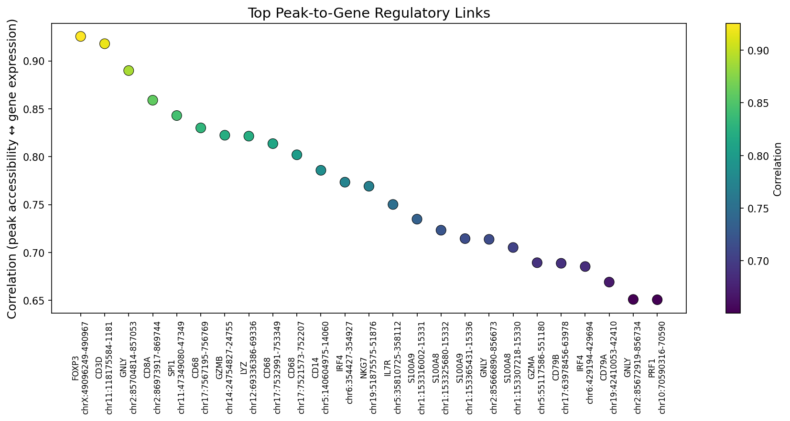

# ImmunOmics

[](https://github.com/pgrady1322/immunomics/actions/workflows/ci.yml)
[](https://www.python.org/downloads/)
[](LICENSE)

**Multi-omics integration of immune cell states from matched scRNA-seq + scATAC-seq data.**

ImmunOmics integrates single-cell gene expression and chromatin accessibility to define immune cell states, link regulatory elements to target genes, and infer transcription factor activity across immune populations.

## Overview

Single-modality analysis captures only part of the picture. ImmunOmics combines RNA and ATAC data from the same cells to:

- **Define immune cell states** by both what genes they express and what chromatin is accessible
- **Link enhancers to target genes** in a cell-type-specific manner
- **Infer TF activity** by connecting motif accessibility to target gene expression
- **Compare integration methods** systematically (WNN, MultiVI, MOFA+)

## Working Example Notebook

See [examples/multiomics_integration_demo.ipynb](examples/multiomics_integration_demo.ipynb) for a full walkthrough of preprocessing, differential analysis, TF activity inference, and visualization — runs entirely on PBMC-derived synthetic data with no downloads required.



*Correlation-based peak–gene regulatory links across 26 immune gene loci (synthetic PBMC data)*

## Key Features

| Feature | Description |
|---|---|
| Multi-method integration | WNN (Seurat v5), MultiVI (scvi-tools), MOFA+ |
| Peak-to-gene linkage | Cell-type-specific enhancer-gene maps |
| TF activity inference | chromVAR motif enrichment + regulon analysis |
| Joint visualization | Integrated UMAP, heatmaps, genome browser tracks |
| Benchmark framework | Systematic comparison of integration methods |

## Installation

```bash
git clone https://github.com/pgrady1322/immunomics.git
cd immunomics
pip install -e ".[dev]"
```

**With conda (full environment including R integration):**

```bash
conda env create -f env.yml
conda activate immunomics
pip install -e .
```

**With ML backends (scvi-tools for MultiVI):**

```bash
pip install -e ".[ml]"
```

## Quick Start

```python
import immunomics as io

# Load 10x Multiome PBMC dataset
adata_rna, adata_atac = io.data.load_multiome_pbmc()

# Preprocess both modalities
adata_rna = io.data.preprocess_rna(adata_rna)
adata_atac = io.data.preprocess_atac(adata_atac)

# Integrate with MultiVI
integrated = io.integration.run_multivi(adata_rna, adata_atac)

# Downstream analysis
peak_gene_links = io.analysis.link_peaks_to_genes(integrated)
tf_activity = io.analysis.infer_tf_activity(integrated)

# Visualize
io.visualization.plot_joint_umap(integrated)
io.visualization.plot_tf_heatmap(tf_activity)
```

## Project Structure

```
immunomics/
├── immunomics/               # Main package
│   ├── __init__.py
│   ├── cli.py                # Click CLI entry points
│   ├── data/                 # Data loading and preprocessing
│   │   ├── datasets.py       # 10x Multiome PBMC loader
│   │   ├── preprocess_rna.py # scRNA-seq preprocessing
│   │   └── preprocess_atac.py# scATAC-seq preprocessing (TF-IDF + LSI)
│   ├── integration/          # Multi-omics integration methods
│   │   ├── multivi.py        # MultiVI (scvi-tools)
│   │   ├── wnn.py            # Weighted nearest neighbors (Seurat v5)
│   │   ├── mofa.py           # MOFA+ multi-omics factor analysis
│   │   └── benchmark.py      # Integration method comparison
│   ├── analysis/             # Downstream analyses
│   │   ├── peak_gene_links.py    # Enhancer-gene linkage
│   │   ├── tf_activity.py        # TF activity via expression + chromVAR
│   │   └── differential.py       # Differential accessibility/expression
│   ├── visualization/        # Plotting functions
│   │   └── plots.py          # Joint UMAP, TF heatmaps, integration comparison
│   └── utils/
│       └── config.py         # YAML configuration loader
├── configs/
│   └── integration.yaml      # Default configuration
├── tests/                     # 41 passing tests
├── .github/workflows/ci.yml  # CI/CD (ruff + pytest)
├── env.yml
├── setup.py
├── pyproject.toml
└── README.md
```

## Data

Primary dataset: **10x Genomics Multiome PBMC** — matched scRNA-seq + scATAC-seq from the same cells.

This dataset contains all major immune populations with paired modalities, making it ideal for demonstrating multi-omics integration on immune cells.

## Integration Methods

### MultiVI (scvi-tools)
Deep generative model that jointly models RNA and ATAC. Learns a shared latent space while accounting for modality-specific noise. Best for: datasets with missing modalities or batch effects.

### WNN (Weighted Nearest Neighbors)
Seurat v5's approach: builds modality-specific neighbor graphs, then weights them per cell based on information content. Best for: well-matched multiome data.

### MOFA+
Multi-Omics Factor Analysis: finds shared and modality-specific sources of variation. Best for: interpretable factor decomposition.

## Downstream Analysis

### Peak-to-Gene Linkage
Correlates peak accessibility with gene expression across cells to identify putative enhancer-gene regulatory connections. Filters by distance and significance.

### TF Activity Inference
Uses chromVAR to score TF motif accessibility per cell, then correlates with TF expression to infer transcription factor activity across immune cell types.

### Differential Analysis
Identifies cell-type-specific peaks and genes, and tests for differential accessibility/expression between conditions.

## CLI

```bash
# Download 10x Multiome PBMC dataset
immunomics download --dataset multiome_pbmc_10k

# Run integration with a specific method
immunomics integrate --method multivi --config configs/integration.yaml

# Benchmark all enabled integration methods
immunomics benchmark --config configs/integration.yaml --output results/
```

## Methods

ImmunOmics implements the complete multi-omics integration workflow:

| Step | Module | Description |
|---|---|---|
| RNA preprocessing | `data.preprocess_rna` | QC → normalize → HVG (Seurat v3) → scale → PCA |
| ATAC preprocessing | `data.preprocess_atac` | QC → peak selection → TF-IDF → LSI (truncated SVD) |
| Integration | `integration.multivi` | Deep generative joint model (scvi-tools) |
| Integration | `integration.wnn` | Weighted nearest neighbors (Seurat v5, via rpy2) |
| Integration | `integration.mofa` | Multi-omics factor analysis (muon) |
| Benchmarking | `integration.benchmark` | Silhouette score + ARI comparison |
| Peak-gene links | `analysis.peak_gene_links` | Correlation-based enhancer-gene linkage with BH correction |
| TF activity | `analysis.tf_activity` | Expression-based + chromVAR motif enrichment |
| Differential | `analysis.differential` | Cell-type-specific DE genes and DA peaks |
| Visualization | `visualization.plots` | Joint UMAP, TF heatmaps, peak-gene scatter, benchmarks |

## License

MIT License — see [LICENSE](LICENSE) for details.
